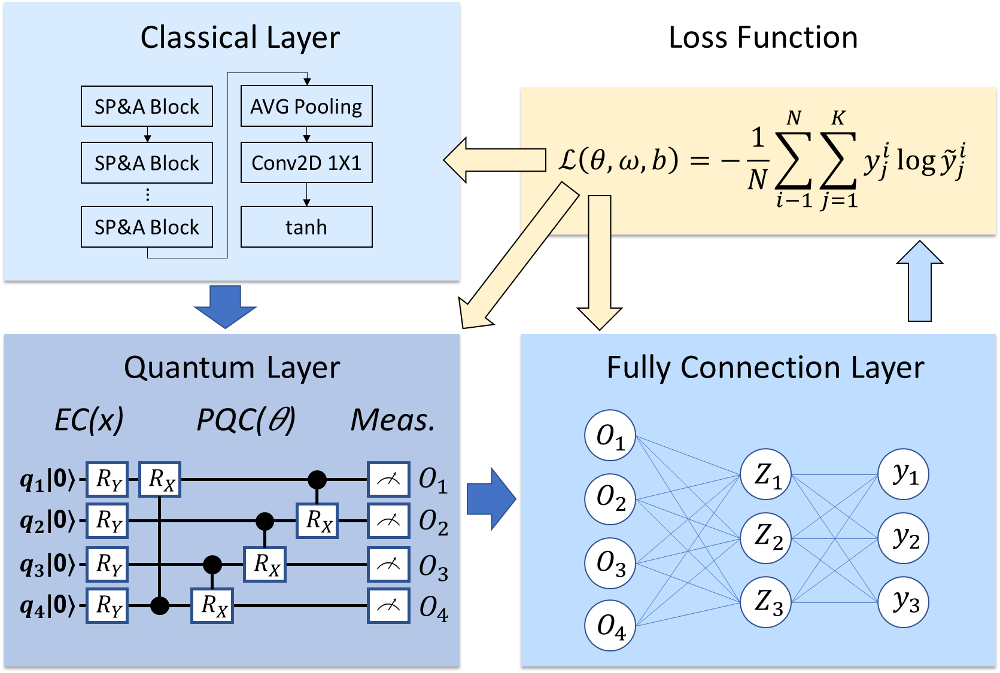
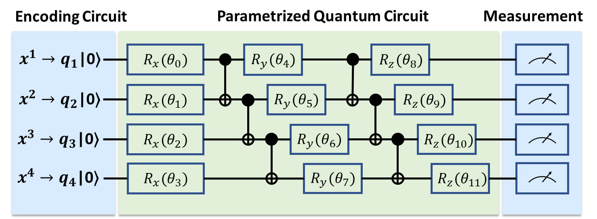

## CVPR2022 - Hybrid Classical-Quantum Deep Learning (HCQDL)
[Project]() | [Arxiv]() | [CVF]() 
### Official tensorflow implementation of the paper: "Semiconductor Defect Detection by Hybrid Classical-Quantum Deep Learning"

[](https://www.youtube.com/embed/80vbhPJXSCM)

## HCQDL's Architecture.
* HCQDL uses quantum circuits to nonlinearly transform classical inputs into features that can then be used in a number of deep learning algorithms. HCQDL consists of classical layer, quantum layer, and fully connection layer. Please refer to ```Hybrid_CNN.py```


### Classical Layer (SP&A-Net)
* The first function of SP&A-Net is the self-proliferation, using a series of linear transformations to generate more feature maps at a cheaper cost. We can train image classifier in a more efficient way. Please refer to ```Self_Proliferate.py```


* The second function is self-attention, capturing the long-range dependencies of the feature map using the channel-wise and spatial attention mechanism. Please refer to ```Self_Attention.py```


* SP&A Block please refer to ```Self_Proliferate_and_Attention.py```


### Quantum Layer
The quantum layer implemented by various quantum circuit built in the continuous-variable architecture. It consists of three consecutive parts (as shown in Figure 8). An encoding circuit encodes classical data to states of the qubits followed by a parametrized quantum circuit (PQC) that is applied to transform these states to their optimal location on the Hilbert space.  Please refer to ```quantum_circuit.py```



## Code

### Install dependencies

```
python -m pip install -r requirements.txt
```

This code was tested with python 3.7  


## Script Introduction

```Self_Proliferate.py``` is used to generate more feature maps (As paper section 3.1).

```Self_Attention.py``` is used to capturing the long-range dependencies of the feature map (As paper secton 3.1).

```Self_Proliferate_and_Attention.py``` follow the spirit of MobileNet,  "capture features in high dimensions and transfer information in low dimensions",  to make the network more efficient. (As paper secton 3.1).

```quantum_circuit.py``` is one sample of Parametrized Quantum Circuit (PQC). Please refer section 3.2 of this paper.

```Hybrid_CNN.py``` is the architecture of Hybrid Classical-Quantum Deep Learning.

```CircleLoss.py``` is used to estimate the loss rate during model training with two elemental deep feature learning approaches: class-level labels and pair-wise labels.

